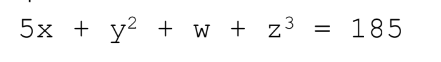

# DSI_AS_AG

Atividade Semestral da disciplina de Desenvolvimento de Sistemas Inteligentes implementando um Algoritmo Genético.

## Algoritmo Genético

Algoritmos Genéticos são inspirados no princípio Darwiniano da evolução das espécies e na genética. São algoritmos probabilísticos que fornecem um mecanismo de busca paralela e adaptativa baseado no princípio de sobrevivência dos mais aptos e na reprodução.

## Objetivo

Exercício proposto na disciplina de Desenvolvimento de Sistemas Inteligentes, de encontrar o máximo de uma equação com quatro variáveis.

- a) Proponha uma maneira de codificar os cromossomos.
- b) Defina uma função de aptidão para avaliar a qualidade dos cromossomos.
- c) Defina como o método de seleção dos pais que será utilizado.
- d) Defina os operadores genéticos de recombinação e mutação.
- e) Gere uma população inicial de 8 a 10 cromossomos e avalie a aptidão deles.
- f) Aplique os operadores de recombinação e mutação sobre essa população para gerar uma nova geração,
em seguida avalie a aptidão da nova geração. Repita esse processo por 8 gerações ou até que a solução do
problema seja encontrada.

### Alunos

- Ester Cardoso Toja
- Igor Bandazs

### Tecnologias

#### Linguagens e Tecnologias

- Delphi
- Markdown

#### Softwares

- Delphi Community Edition;
- Visual Studio;
- Git ;
- GitHub;
  
## Manual de Usabilidade

Ao executar o código é apresentado uma janela o qual possui os seguintes componentes:

- Quatro caixa de textos editáveis:

  - **Quant corte**:

  - **Ponto Corte**: É a quantidade de indivíduos para a próxima população como critério a seleção dos primeiros indivíduos para a próxima população a ser gerada. Campo editável, valor default 4.

  - **Taxa de Mutação**: Previne que uma dada posição fique estagnada em um valor.  Campo editável, valor default 12.

  - **Épocas**:
    Quantas vezes será executado o treinamento do Algoritmo Genético. Campo editável, valor default 4.

- **Tabela 1:** Possui as colunas x, y, z, w e cromossomos e o resultado.

- **Tabela 2:** Possui as colunas de cromossomos e resultados.

- E o button de **"Começar"**.

## Relatório de Desempenho

#### 1°Configuração:

Utilizando os parâmetros default do algoritmo, tivemos como resultado na primeira Época:

1° Época:

2° Época:

3° Época:

4° Época:

5° Época:

6° Época:

Descrição dos acontecimentos
