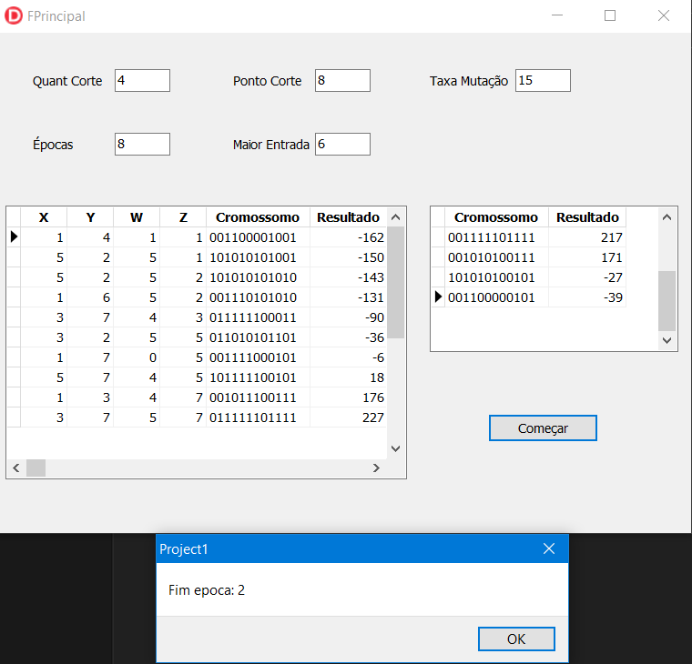
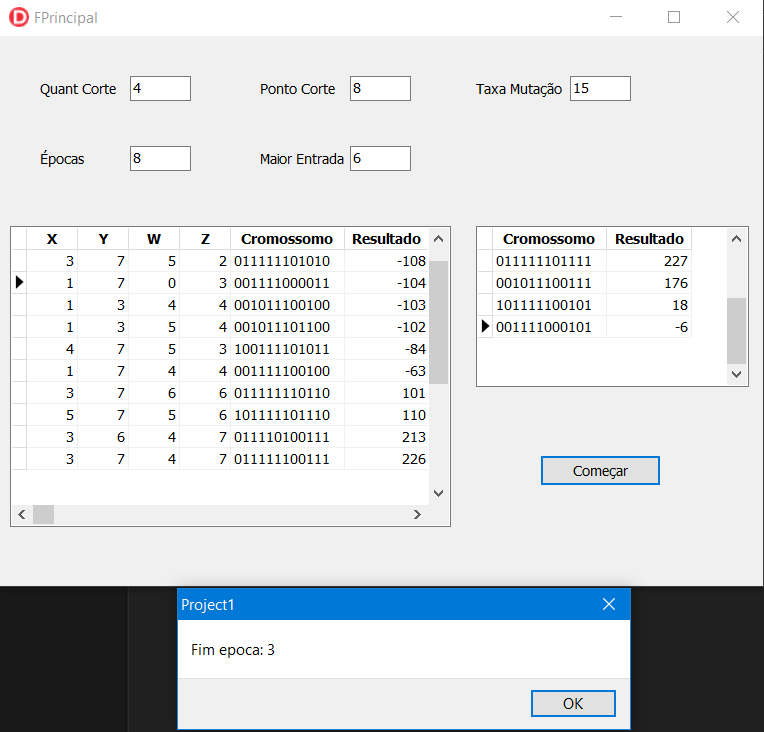

# DSI_AS_AG

Atividade Semestral da disciplina de Desenvolvimento de Sistemas Inteligentes implementando um Algoritmo Genético.

## Algoritmo Genético

Algoritmos Genéticos são inspirados no princípio Darwiniano da evolução das espécies e na genética. São algoritmos probabilísticos que fornecem um mecanismo de busca paralela e adaptativa baseado no princípio de sobrevivência dos mais aptos e na reprodução.

## Objetivo

Exercício proposto na disciplina de Desenvolvimento de Sistemas Inteligentes, de encontrar o máximo de uma equação com quatro variáveis.

- a) Proponha uma maneira de codificar os cromossomos.
- b) Defina uma função de aptidão para avaliar a qualidade dos cromossomos.
- c) Defina como o método de seleção dos pais que será utilizado.
- d) Defina os operadores genéticos de recombinação e mutação.
- e) Gere uma população inicial de 8 a 10 cromossomos e avalie a aptidão deles.
- f) Aplique os operadores de recombinação e mutação sobre essa população para gerar uma nova geração,
em seguida avalie a aptidão da nova geração. Repita esse processo por 8 gerações ou até que a solução do
problema seja encontrada.

### Alunos

- [Ester Cardoso Toja](https://www.linkedin.com/in/ester-toja-692a6566/)

- [Igor Bandazs](https://www.linkedin.com/in/igor-bandasz-864410167/)

### Tecnologias

#### Linguagens e Tecnologias

- Delphi
- Markdown

#### Softwares

- Delphi Community Edition;
- Visual Studio;
- Git ;
- GitHub;
  
## Manual de Usabilidade

Ao executar o código é apresentado uma janela o qual possui os seguintes componentes:

- Quatro caixa de textos editáveis:

  - **Quant corte**: Quantos serão escolhidos ara a próxima geração. Default 4.

  - **Maior Entrada**: Define o range que será utilizado para o sorteio. Default 6.

  - **Ponto Corte**: É a quantidade de indivíduos para a próxima população como critério a seleção dos primeiros indivíduos para a próxima população a ser gerada. Campo editável, valor default 8.

  - **Taxa de Mutação**: Previne que uma dada posição fique estagnada em um valor.  Campo editável, valor default 15.

  - **Épocas**:
    Quantas vezes será executado o treinamento do Algoritmo Genético. Campo editável, valor default 8.

- **Tabela 1:** Possui as colunas x, y, z, w e cromossomos e o resultado.

- **Tabela 2:** Possui as colunas de cromossomos e resultados.

- E o button de **"Começar"**.

## Relatório de Desempenho

### 1° Configuração

Utilizando os parâmetros default do algoritmo, tivemos como resultado na primeira Época:

#### 1° Época

#### 2° Época

#### 3° Época

#### 4° Época

#### 5° Época

#### 6° Época

#### 7° Época

#### 8° Época

Podemos observar que com estes parâmetros na 8° Época não conseguimos nos aproximar dos valores corretos. Obtivemos dentro da população valoros que ficaram muito distante do dos valores esperados. E durante as épocas a  5° e 7° discrepância  entre os valores dos cromossomos foram diminuindo, porém depois aumentou a diferença dos valores.

### 2° Configuração

Alterando o valor de **Taxa de Mutação** para **12** e mantendo os demais parâmetros **default**:

#### 1°Época

Neste caso, diminuímos a **Taxa de Mutação** e o sistema entrou em loop e encerrando a execução do programa. No caso da taxa de mutação ter o valor 12 entra em loop porque somando todos os cromossomos temos 120 genes. A taxa de mutação é a cada 12 genes e 1 mutação, sendo assim um filho não pode receber 2 mutações, (exclusivamente no nosso caso), isso faz com que toda a população de 10 indivíduos tenham mutação. Devido a todos terem mutação e o programa estar se baseando em apenas 1 mutação por indivíduo então ele entra em loop procurando alguém que não tenha sido mutado ainda e acaba encerrando programa.

### Conclusão

Um ponto importante de ser considerado é cada vez que é executado é sorteado números totalmente aleatórios e que devido a isto os resultados podem alterar de execução para execução.

De forma geral notamos que os resultados:

- Não conseguimos chegar perto dos resultados esperados.
- Para chegar próximo dos resultados corretos é necessário que o valores fiquem próximo do valor zero.
- Durante as épocas podemos notar que o entre as épocas os valores diminuem sua discrepancia e depois voltam a se distanciar tornando a diferença entre eles grande.
